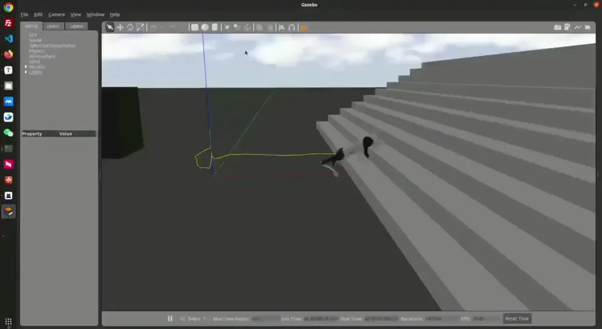

# RL_Deployment

Quadruped robots locomotion learning and deployment framework based on the [unitree_guide](https://github.com/unitreerobotics/unitree_guide)'s FSM.

- Sim: The model is trained through isaacgym and rsl_rl. And then simulated in gazebo.
- Real: The model is tested on real robot. Takes unitree go1 for example.

<p align="center">

</p>


## 0. Dependencies

This project uses `ros-noetic` (Ubuntu 20.04) and requires the installation of the following ROS dependency packages:

```
sudo apt install ros-noetic-teleop-twist-keyboard ros-noetic-controller-interface ros-noetic-gazebo-ros-control ros-noetic-joint-state-controller ros-noetic-effort-controllers ros-noetic-joint-trajectory-controller
```

Download and deploy `libtorch` at any location:

```
cd /path/to/your/torchlib
wget https://download.pytorch.org/libtorch/cpu/libtorch-cxx11-abi-shared-with-deps-2.0.1%2Bcpu.zip
unzip libtorch-cxx11-abi-shared-with-deps-2.0.1+cpu.zip -d ./
echo 'export Torch_DIR=/path/to/your/torchlib' >> ~/.bashrc
```

Modify the libtorch path in the file `unitree_guide/unitree_guide/CMakeLists.txt`:

```
set(Torch_DIR /yourpath/libtorch/share/cmake/Torch)
```

Download the repository:

```
git clone https://github.com/xxxx.git
```

## 1. Compile

### Step1: RL Model

Modify the model path in the file `unitree_guide/unitree_guide/CMakeLists.txt`:

```cmake
set(BODY_MODEL_PATH "${CMAKE_CURRENT_SOURCE_DIR}/model/body.jit")
add_definitions(-DBODY_MODEL_PATH="${BODY_MODEL_PATH}")
```

Here you can customize and add your own models. Modify the corresponding model loading method in `unitree_guide\unitree_guide\src\FSM\State_RL.cpp`. Please pay attention to the function `void State_RL::_loadPolicy()` and `void State_RL::_action_compute()`

### Step2: Related Parameters

Please check the order of input and output variables and related parameters. Mainly seen in `unitree_guide\unitree_guide\src\FSM\State_RL.cpp` and `unitree_guide\unitree_guide\include\FSM\State_RL.h`

### Step3: Compile the project

By modifying `CMakeLists.txt`, the switch between simulation and deployment can be achieved.

Run in the directory where `src` is located

``` 
catkin_make
```

## 2. Run

### Simulation

start gazebo:

```
source devel/setup.bash
roslaunch unitree_guide gazeboSim.launch
```

Create a new terminal and run the controller:

```
source devel/setup.bash
sudo ./devel/lib/unitree_guide/junior_ctrl
```

Press the key `2` and the robot will stand up. Then press the key `4`, the robot will enter the reinforcement learning state machine. After the robot stands firm, control the movement through the keyboard.

In the terminal, you can use the 'w' 's' 'a' 'd' keys to control the robot's x and y-axis speed, and the 'j' 'l' keys to control the robot's rotation.

### Real

Make the following changes in the file  `unitree_guide/unitree_guide/CMakeLists.txt`:

```
set(SIMULATION OFF)         # Use Gazebo or not, ON or OFF
set(REAL_ROBOT ON)          # Link real robot or not, ON or OFF
```

Compile:
```
catkin_make
```

Connect the computer and the robot through a network cable. Please make sure you can ping the robot. Please refer to Unitree repository for details.

Start the robot, and after the robot stands up, run this in the terminal:

```
sudo ./devel/lib/unitree_guide/junior_ctrl
```

At this time, the robot will sit down and enter the passive state. Press `L2+A`, the robot will stands up. Then press 'start'. At this time, the robot enters the reinforcement learning state machine, controlling the robot's x- and y-axis speeds through the left joystick, and controlling the robot's rotation through the right joystick.

## Acknowledgments

Thanks to Unitree official for providing the `unitree_guide` project.

Thanks to https://github.com/dstx123/unitree_rl.

